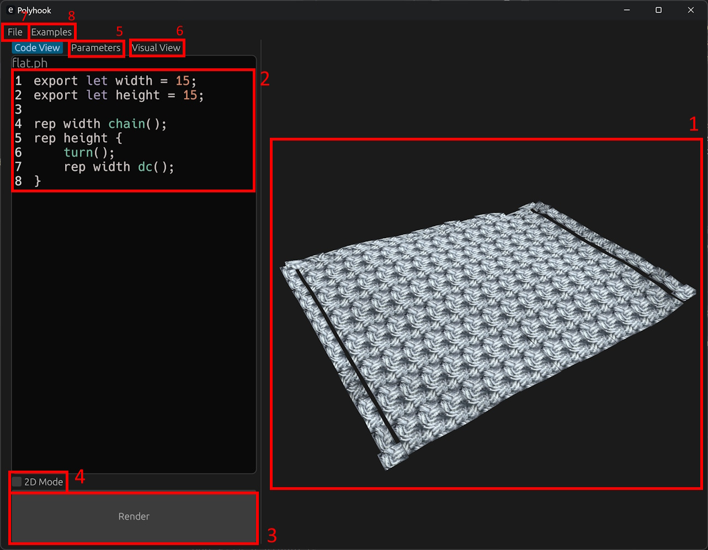

# Polyhook - Parametric Crochet CAD software
[Github Link](https://github.com/william-gooch/polyhook)

Polyhook is a parametric CAD software package for creating crochet patterns. It allows the user to program patterns using the Rhai scripting language and visualize them as a 3D model.

## Building

This project is built in **Rust**, and requires the latest nightly version to be installed.

### Windows
Download `rustup-init.exe` at [https://rustup.rs/](https://rustup.rs/), then run and select `2) Customize Installation` and choose default host triple, `nightly` toolchain, and `minimal` profile.

### Linux
```bash
curl --proto '=https' --tlsv1.2 -sSf https://sh.rustup.rs | sh -- --default-toolchain nightly --profile minimal
```

Then, clone the repository and run `cargo build --release` which will build the project.

The executable will be available at `target/release/polyhook(.exe)`

## Usage

Start the application with `polyhook`, or with a file path as an argument to start with a file open, e.g. `polyhook hooklib/examples/sphere.ph`.

|   |                                                                                            |
|---|--------------------------------------------------------------------------------------------|
| 1 | The final 3D model of the written pattern. Click and drag to rotate, or scroll to zoom in. |
| 2 | The code view, where a pattern script can be written.                                      |
| 3 | Renders the script as a 3D model.                                                          |
| 4 | Restricts the model to two-dimensions, i.e. a flat sheet.                                  |
| 5 | Changes the parameters exported from the written script.                                   |
| 6 | Allows you to create a model through visual scripting rather than code.                    |
| 7 | Open or save a pattern as a `.ph` file.                                                    |
| 8 | Open example patterns included with the software.                                          |


## Scripting

This software uses the [Rhai scripting language](https://rhai.rs/) to write patterns. For basic syntax, refer to [Rhai's documentation](https://rhai.rs/book/).

An overview of each Polyhook-specific function is as follows:
| | |
|-|-|
|`chain`|Work a new chain stitch|
|`skip`|Skip the current stitch in the base row|
|`dc`|Work a double crochet into the current insertion point, then skip|
|`dc_`|As above, but don't skip|
|`new_row`|Start a new row|
|`turn`|Start a new row and turn, working in alternating row order|
|`turn_`|As above, but don't skip the first stitch of the row|
|`dec`|Work a decrease|
|`magic_ring`|Start the part with a magic ring|
|`ss`|Work a slip stitch into the given stitch|
|`into`|Move the insertion point into the next stitch|
|`mark`|Mark the last stitch worked and return a reference to it|
|`curr`|Return a reference to the current insertion point|
|`row`|Return a list of references to all stitches in the current row|
|`chain_space`|Create a chain space with all stitches worked in the given function or closure, and return a reference to it|
|`ignore`|Work all stitches in the given function or closure, without adding them to the current row|
|`new_part`|Create a new part, disconnected from the last one|
|`sew`|Take two lists of stitches, and sew them together pairwise|
